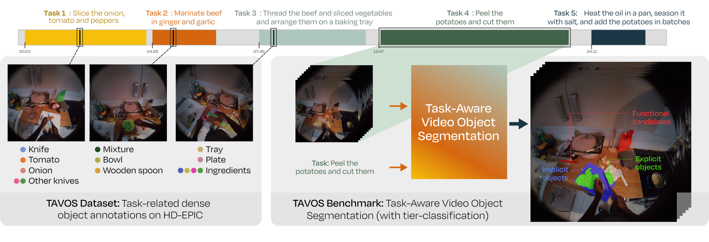

# TAVOS: Task-Aware Video Object Segmentation in Egocentric Vision

<p align="center">
  
</p>

<p align="center">
  <!-- <a href="https://arxiv.org/abs/XXXX.XXXXX"></a> -->
  <a href="https://creativecommons.org/licenses/by/4.0/"></a>
  
  
  
</p>

---

## Abstract

> We introduce TAVOS (Task-Aware Video Object Segmentation), a novel benchmark built upon HD-EPIC to evaluate a model's ability to ground objects through procedural reasoning. While current VOS benchmarks primarily focus on explicit linguistic descriptions, we argue that effective egocentric AI assistants must identify objects based on their functional relevance to high-level tasks even when those objects remain unmentioned in the instructions. 
Beyond its conceptual novelty, TAVOS contributes a massive set of dense, temporally-consistent mask annotations, curated at the task-level, and organized into a novel functional taxonomy that enables to distinguish between shallow textual grounding and genuine functional reasoning.
Unlike traditional Referring VOS metrics that focus on pixel-level accuracy, we introduce a new evaluation protocol that quantifies independently object-level reasoning (what to segment) and mask-level quality (how to segment), revealing critical failures in current models' task-understanding.
Finally, we evaluate state-of-the-art end-to-end vision-language architectures against a proposed modular pipeline that decouples semantic reasoning from segmentation. 
Our results reveal a significant performance gap in current end-to-end architectures when prompted with task-level segmentation. We show that our pipeline combined with temporal tracking significantly enhances spatio-temporal coherence, setting a new baseline for the benchmark.
TAVOS provides an interpretable and practical foundation for future research in functional scene understanding for egocentric assistance.
---

## Installation

The following steps set up the full TAVOS environment.

---

### 1. Create the Conda Environment

```bash
conda create -n TAVOS_env python=3.12.12
conda activate TAVOS_env
```
---

### 2. Install PyTorch (CUDA 12.8)

Install PyTorch, TorchVision, and xFormers **before** any other dependencies. This ensures all subsequent packages link against the correct CUDA and torch versions.

```bash
pip install torch==2.10.0 torchvision==0.25.0 xformers==0.0.35 --index-url https://download.pytorch.org/whl/cu128
```

---

### 3. Install other dependencies
```bash
pip install -r requirements.txt
```
or 

```bash
pip install -r requirements_linux.txt
```

if linux.

---
### 4. Install SAM 3

Clone the official SAM 3 repository and install it in editable mode:

```bash
git clone https://github.com/facebookresearch/sam3.git
cd sam3
pip install -e .
```
---
### 5. TAVOS Demo

It is possible to test the behaviour of the Qwen3.5-4B + Grade + SAM3 +Prop. baseline running `qwen_sam_video.py`. We provide a minimal example of a sequence to test the pipeline.

### 6. Metrics of the dataset

`metric_TAVOS.py` permits obtaining the metrics shown in the manuscript. For that you need to download the annotations from the ([TAVOS hugging-face repository](https://huggingface.co/datasets/TAVOSdataset/TAVOS)) and extract the frame-set from the original [HD-Epic Videos](https://hd-epic.github.io/site/#download) using `extract_gt.py`.

## License

This project is released under the [Creative Commons Attribution 4.0 International License (CC BY 4.0)](https://creativecommons.org/licenses/by/4.0/).

[](https://creativecommons.org/licenses/by/4.0/)

You are free to share and adapt this work for any purpose, including commercially, as long as appropriate credit is given.
